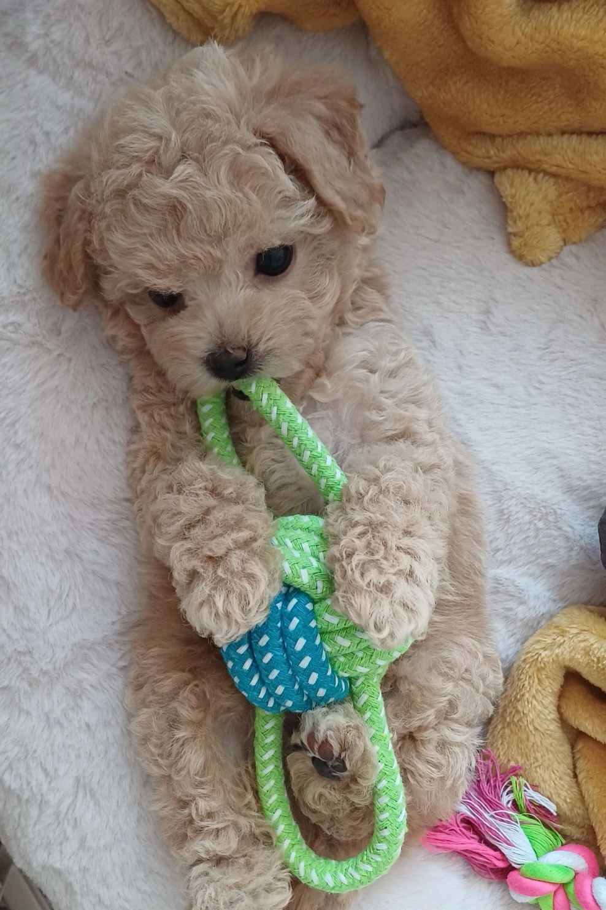

# 앵두랩

**앵두랩**은 프로젝트 진행 중 마주치는 다양한 기술적 과제를 탐구하고, 이를 통해 실질적인 학습과 경험을 쌓는 것을 목표로 합니다. 미션 기반으로 진행되며, 학습한 내용을 공유하고 협력하며 성장하는 공간입니다.

## 🐾 앵두랩의 의미

<table>
  <tr>
    <td style="width: 50%; vertical-align: top; padding-right: 20px;">
    
<strong>"앵두랩"</strong>은 메인테이너의 강아지 <strong>앵두</strong>의 이름에서 유래되었습니다. 
    앵두는 태어난 지 <strong>2주 만에 몸무게가 2배로 늘며 빠르게 성장</strong>했습니다. 
    이처럼 짧은 시간에 <strong>빠르게 배우고 성장하는 공간</strong>이 되기를 바라는 마음으로 이름을 지었습니다.

    </td>
    <td style="width: 50%; text-align: center;">
    
    </td>
  </tr>
</table>

## 🚀 현재 제공하는 미션

### 🛰 **우주여행 티켓 재고 관리 시스템 설계**
- **목표**: 1분 내에 매진되는 인기 있는 행성 여행 티켓 판매 시스템에서 **동시 발급 문제** 해결
- **주요 학습 내용**:
  

  
<strong>확인하기</strong>

  <ul>
    <li>Java 잠금</li>
    <li>데이터베이스 수준의 잠금</li>
    <li>분산 잠금</li>
  </ul>
  

- **기술 스택**: Java, Spring Boot, Spring Data JPA, MySQL
- 👉 [문제 확인하기](./ticket/PROBLEM.md)

### 🔥 **인기 상품 서비스 개선**
- **목표**: **성능 최적화** 및 사용자 경험 향상
- **주요 학습 내용**:
  

  
<strong>확인하기</strong>

  <ul>
    <li>캐싱</li>
    <li>쿼리 최적화</li>
    <li>대규모 트래픽 처리</li>
  </ul>
  

- **기술 스택**: Java, Spring Boot, Spring Data JPA, MySQL
- 👉 [문제 확인하기](./trend-item/PROBLEM.md)

### 📧 **분산 환경에서 메일 발송 시스템 구축**
- **목표**: 분산 환경에서 **중복 발송 없는 안정적인** 메일 발송 시스템을 구축
- **주요 학습 내용**:
  

  
<strong>확인하기</strong>

  <ul>
    <li>모듈러 연산</li>
    <li>분산 잠금</li>
    <li>분산 스케줄링</li>
    <li>skip locked</li>
  </ul>
  

- **기술 스택**: Java, Spring Boot, Spring Data JPA, MySQL
- 👉 [문제 확인하기](./distributed-mail/PROBLEM.md)

---

## 📚 사용 방법

### 1. 미션 진행 방법
- 매 미션마다 특정 기술과 관련된 주제가 주어집니다.
- 주제에 맞는 코드를 작성하며 발생하는 문제를 해결하고 함께 고민합니다.
- 고민한 내용은 기록하고 공유합니다.

### 2. 학습 내용 정리 방법
- 각 미션 수행 후 학습한 내용을 **마크다운 파일**로 정리합니다.
- 정리 내용에는 문제 상황, 해결 과정, 코드 스니펫, 참고 자료 등을 포함합니다.

### 3. 내용 공유
- 정리한 학습 내용을 공유하고 피드백 받습니다. 
- PR 또는 개인 블로그에 공유합니다.

---

## 🔄 미션 제출

PR을 통해 자신이 해결한 방법을 저장소에 공유할 수 있습니다.

### 1. **브랜치 컨벤션**
- 브랜치는 `{미션 이름}/{자신의 GitHub ID}-{해결 방법}` 형식으로 작성합니다.
- 예: `ticket/3juhwan-optimized-lock`

### 2. **지식 공유**
다음 두 가지 방법 중 선택해 주세요. 
- 각 PR에는 **최상단 폴더에 `SOLUTION.md` 파일**이 포함해 주세요. `SOLUTION.md` 파일에는 문제 해결 과정, 방법, 코드 스니펫 등을 정리해 주세요.
- `SOLUTION.md` 대신에 학습한 내용을 기록한 **개인 블로그**가 있다면 링크를 공유해 주세요. 

### 3. (선택) **추가 자료 첨부**
- 참고한 블로그나 외부 자료가 있다면 링크를 첨부해 주세요.

### 4. **피드백과 논의**
- PR은 다른 참가자들과 함께 해결 방법을 논의하고 피드백을 받을 수 있는 공간입니다.
- 적극적으로 의견을 주고받으며 서로의 성장을 돕습니다.

---

## 🛠 이슈 발행

미션을 진행하다가 발견한 **버그** 또는 **수정할 사항**이 있다면 **이슈** 또는 **PR**을 보내주세요. 함께 성장하는 데 큰 도움이 됩니다! 

**이슈 작성 가이드**
1. 발생한 문제를 명확히 설명합니다.
2. 문제 재현 방법과 로그(있다면)를 첨부합니다.
3. 개선 아이디어나 예상 해결 방법을 제안합니다.

**PR 요청 가이드**
1. 리포지토리를 clone하고 코드를 수정합니다.  
2. 브랜치 명은 fix-{}로 합니다. 예) fix-convention
3. main 브랜치로 PR을 제출합니다. 

---

## 🎯 기여 및 참여

기술적인 고민에 관심이 있거나 함께 고민하고 싶은 문제가 있다면, 언제든지 참여하실 수 있습니다.  
자세한 내용이 궁금하시거나 문의가 필요하시면, [메인테이너에게 메일](mailto:13selfesteem91@naver.com)을 보내주세요. 참여를 환영합니다! 🚀  
